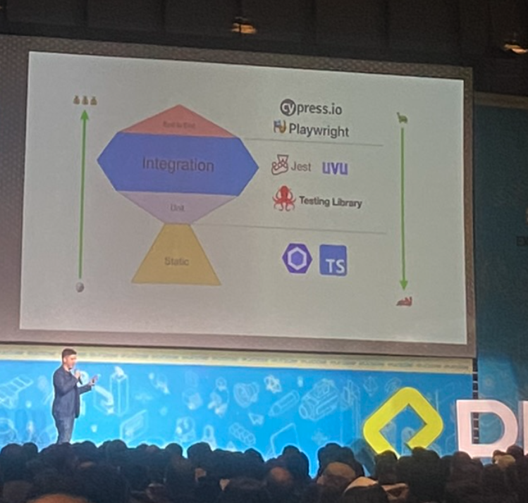
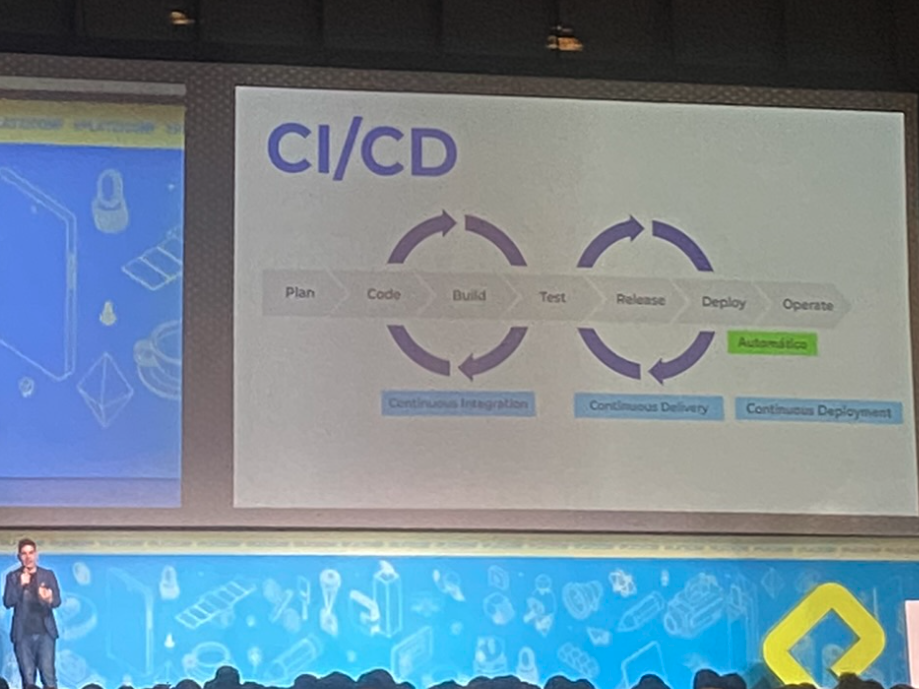

# Jest

## Why is it important to test

Testing is a way to experiment and verify the code you are developing.

## What is Jest

[Jest](https://jestjs.io/) is a delightful JavaScript Testing Framework with a focus on simplicity.

It works with projects using: Babel, TypeScript, Node, React, Angular, Vue and more.

It was created by Facebook.

It provides:

- Custom configuration.
- Snapshots (keep track of the changes).
- Great API.
- Fast and safe.
- Code Coverage.
- Easy Mocking.
- Great Exceptions.

## Unit Testing

Its purpouse is to verify the behavior of a small piece of software, independently from other parts. The main goals are:

- Isolate a section of code.
- Verify the correctness of the code.
- Test every function and procedure.

## Integration Testing

Integration Testing is the second level of the software testing process. It comes after unit testing.

The units or individual components of the software are tested in a group.

## End to End Testing

End to End testing involves testing an application’s workflow from beginning to end. It should replicate real user escenarios.




## Install Jest

Jest ships as an NPM package.

`npm i jest --save-dev`

```js
 "scripts": {
    "test": "jest"
  },
```

## How to create tests

By default, Jest expects to find test files in a folder called \***\*tests\*\***.

## Exercise

Let's build a calculator and test it.

## Sources

- [Jest Docs](https://jestjs.io/).
